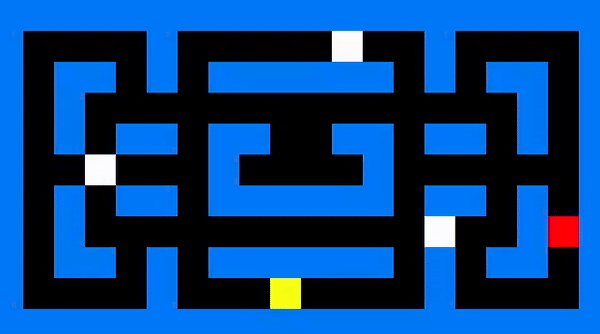

<h1 align="center">maze-asm</h1>

<em>A project by Flor Ronsmans De Vry for the Computer Systems and Architecture course at the University of Antwerp.</em>

</img>

___

## Technologies used
- MIPS assembly language
- [MARS (MIPS Assembler and Runtime Simulator)](http://courses.missouristate.edu/kenvollmar/mars/)

## Project overview
- `maze.asm`: final version of the project
- `resources/coord-address.asm` program to convert coordinates to memory addresses 
- `resources/red-bitmap.asm` program to show red bitmap through memory-mapped I/O 
- `resources/keyboard-listener.asm` program to listen for memory-mapped input
- `resources/input-parser.asm` program to parse received input
- `read-file.asm` program to read file on host

Misc:
- `resources/demo-base.mp4` Base game demo (including candies/gatekeepers)
- `resources/demo-extension.mp4` Extended game demo (automated)